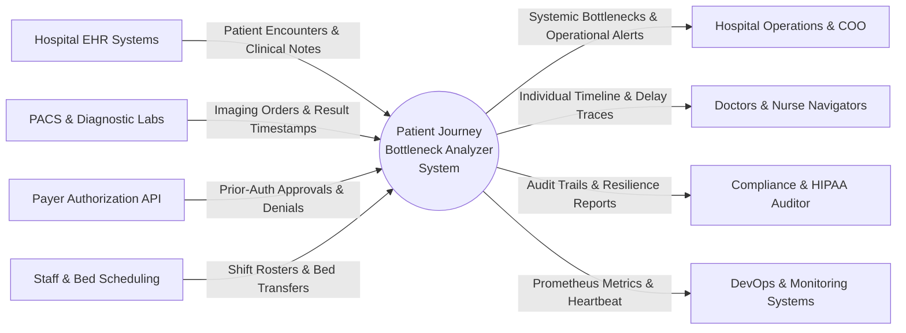
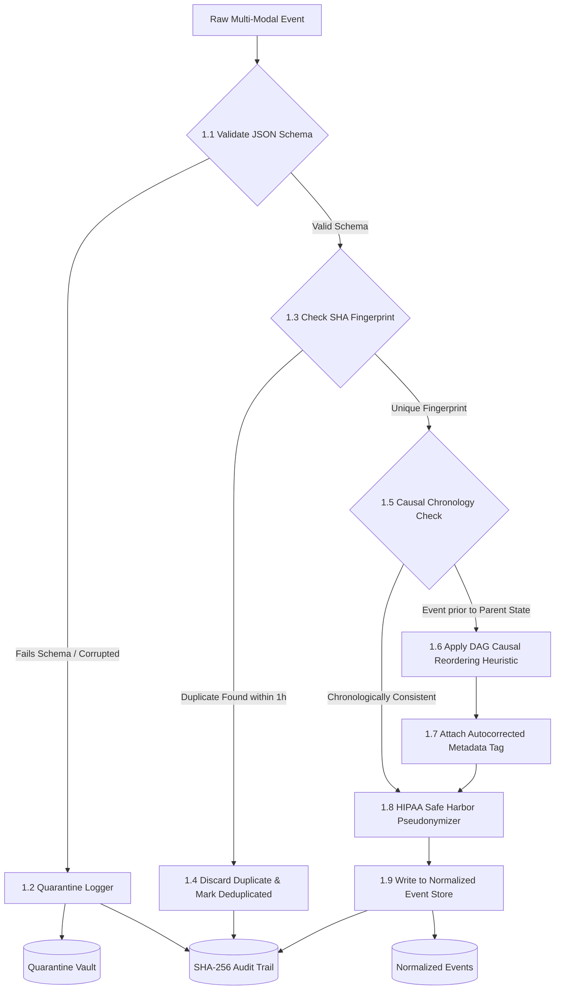

# Data Flow Diagrams (DFD)
## Project: Patient Journey Bottleneck Analyzer (PNH1)

---

### DFD Level 0: Context Diagram

The context diagram illustrates the macro data interactions between external entities (Hospital staff, clinical data feeds, payers) and the Bottleneck Analyzer system.



---

### DFD Level 1: Subsystem Breakdown

DFD Level 1 decomposes the internal processes, showing how clinical data flows through ingestion, normalization, storage, graph generation, correlation, and presentation.

```mermaid
flowchart TD
    %% External Entities
    E1[Multi-Source Clinical Feeds]
    E2[Hospital Decision Makers]
    E3[Compliance Auditor]

    %% Data Stores
    D1[(D1: Patients & Journeys Store)]
    D2[(D2: Normalized Events Store)]
    D3[(D3: Quarantined Records Store)]
    D4[(D4: SHA-256 Audit Trail)]
    D5[(D5: Aggregated Graph & Metric Cache)]

    %% Processes
    P1[1.0 Ingest & Adversarial Cleansing]
    P2[2.0 Timeline Reconstruction & Process Mining]
    P3[3.0 Bottleneck Detection Engine]
    P4[4.0 Root Cause Correlation AI]
    P5[5.0 Counterfactual Simulator]
    P6[6.0 Interactive Visualization API]

    %% Ingestion Flow
    E1 -->|Raw Event Payloads| P1
    P1 -->|Corrupted/Adversarial Payloads| D3
    P1 -->|Ingestion Hash & Correction Tags| D4
    P1 -->|Clean, Normalized Events| D2
    P1 -->|Pseudonymized Patient Profiles| D1

    %% Processing Flow
    D2 -->|Chronological Event Traces| P2
    P2 -->|Direct Transition Graph Matrix| D5
    D5 -->|Transition Latencies & Queues| P3
    P3 -->|Identified Choke Points (BCI)| P4
    D2 -->|Operational Metadata| P4
    P4 -->|Root Cause Coefficients & Interventions| D5
    
    %% Simulation Flow
    E2 -->|Intervention Parameters| P5
    D5 -->|Baseline Latency Distributions| P5
    P5 -->|Projected Reduction Metrics| E2

    %% Dashboard / API Delivery
    D5 --> P6
    D4 --> P6
    P6 -->|Visual Journey, Alerts, Heatmaps| E2
    P6 -->|Verifiable Cryptographic Log Chain| E3
```

---

### DFD Level 2: Detailed Process 1.0 (Adversarial Data Ingestion)

This diagram inspects Process 1.0 showing how incoming streams undergo schema validation, causal DAG reordering, deduplication, and HIPAA anonymization.


