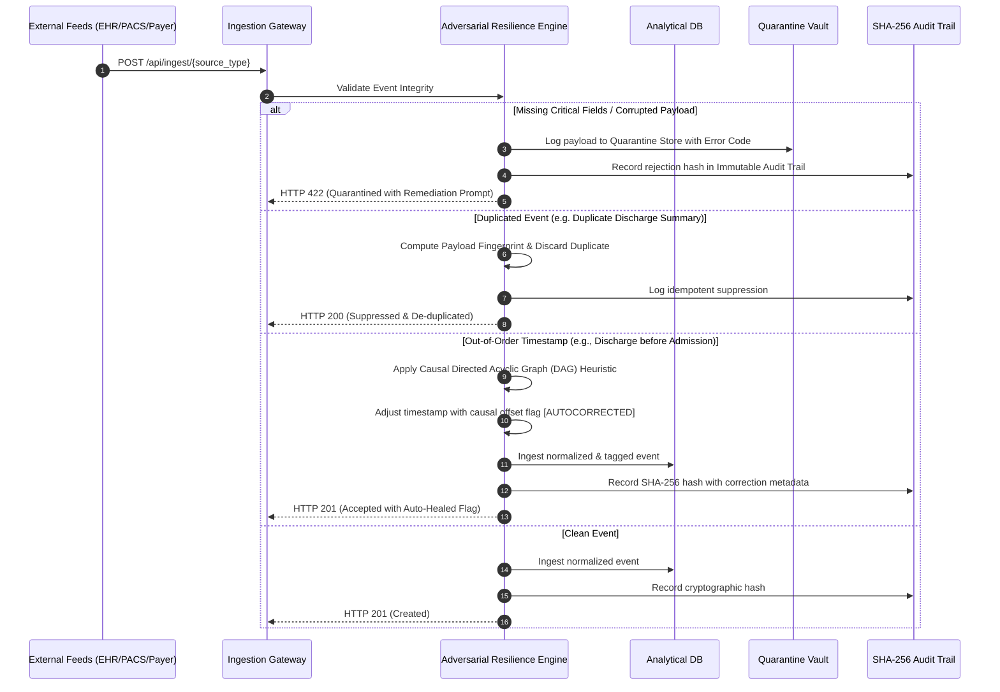

# System Architecture & Technical Blueprint
## Project: Patient Journey Bottleneck Analyzer (PNH1)

---

### 1. High-Level Architectural Overview

The system is designed following modern event-driven, decoupled microservices patterns, optimized for high throughput, adversarial data resilience, and sub-second analytical queries.

```mermaid
flowchart TB
    subgraph DataSources["Heterogeneous Healthcare Data Sources"]
        EHR["EHR Systems (Epic/Cerner)<br/>• Admissions & Discharge<br/>• Clinical Notes & Triage"]
        PACS["Diagnostic Systems (PACS/LIS)<br/>• Imaging & MRI/CT<br/>• Pathology & Blood Labs"]
        PAYER["Payer Pre-Authorization Feeds<br/>• Prior-Auth Requests<br/>• Claim Denial/Approval"]
        SCHED["Hospital Scheduling Feeds<br/>• Specialist Consults<br/>• OR & Bed Allocation"]
    end

    subgraph IngestionBoundary["Adversarial Ingestion & Resilience Gateway"]
        AUTH["HIPAA Auth & JWT Guard"]
        SCHEMA["Multi-Modal Schema Normalizer (FHIR R4/JSON)"]
        RESILIENCE["Adversarial Resilience Engine<br/>• Causal Dependency Sorter<br/>• Deduplication Hash Cache<br/>• Anomaly & Quarantine Router"]
        PSEUDO["HIPAA Safe-Harbor Pseudonymization"]
    end

    subgraph StorageLayer["Secure Data Persistence Layer"]
        DB[(Analytical Store - SQLite/PostgreSQL)]
        QUARANTINE[(Quarantined Anomalies Store)]
        AUDIT[(Cryptographic SHA-256 Audit Chain)]
    end

    subgraph AnalyticalCore["Analytical & Intelligence Engines"]
        RECON["Process Mining & Journey Reconstructor<br/>• Direct Transition Matrix<br/>• Trace Alignment Algorithm"]
        BOTTLENECK["Statistical Bottleneck Engine<br/>• P50 / P90 / P99 Latency<br/>• Choke Point Criticality Index (BCI)"]
        AI_CORR["Root Cause Correlation Engine<br/>• Pearson/Spearman Multivariate Matrix<br/>• AI Intervention Generator"]
        SIM["Counterfactual 'What-If' Simulation Engine<br/>• Queueing & Capacity Reduction Models"]
    end

    subgraph PresentationLayer["Command Center & Interactive Dashboard"]
        WEB["High-Performance Web Client"]
        GRA_VIEW["Interactive Process Graph Explorer"]
        TIM_VIEW["Patient Trace Timeline with Repair Badges"]
        AI_VIEW["Root Cause Matrix & Choke Point Heatmap"]
        SIM_VIEW["Interactive Capacity Simulator"]
        ADVER_SANDBOX["Adversarial Live Injection Sandbox"]
        AUDIT_VIEW["HIPAA Audit & Cryptographic Verifier"]
    end

    DataSources --> IngestionBoundary
    IngestionBoundary --> StorageLayer
    StorageLayer --> AnalyticalCore
    AnalyticalCore --> PresentationLayer
```

---

### 2. Adversarial Resilience Pipeline

Healthcare event feeds are notoriously noisy, corrupted, and out-of-sequence. The diagram below illustrates how raw events pass through our multi-stage resilience pipeline:

---

### 3. Bottleneck Criticality Index ($BCI$) Formulation

To mathematically quantify bottlenecks rather than relying on arbitrary wait-time thresholds, our statistical engine calculates the **Bottleneck Criticality Index ($BCI$)** for every transition $(u \to v)$ across all patient journeys:

$$BCI(u \to v) = w_1 \cdot \frac{T_{P90}(u \to v)}{T_{SLA}(u \to v)} + w_2 \cdot \frac{\sigma(u \to v)}{\mu(u \to v)} + w_3 \cdot \frac{N_{queued}(u \to v)}{N_{total}}$$

Where:
- $T_{P90}$: 90th percentile transition latency (hours/minutes).
- $T_{SLA}$: Clinical target Service Level Agreement duration for that transition.
- $\frac{\sigma}{\mu}$: Coefficient of Variation (measures operational volatility and unpredictability).
- $\frac{N_{queued}}{N_{total}}$: Proportion of hospital volume currently stalled at this transition.
- $w_1, w_2, w_3$: Standardized weights ($0.5, 0.3, 0.2$).

Transitions with $BCI \ge 2.5$ are automatically flagged as **CRITICAL CHOKE POINTS**, triggering automated administrative root cause synthesis.
