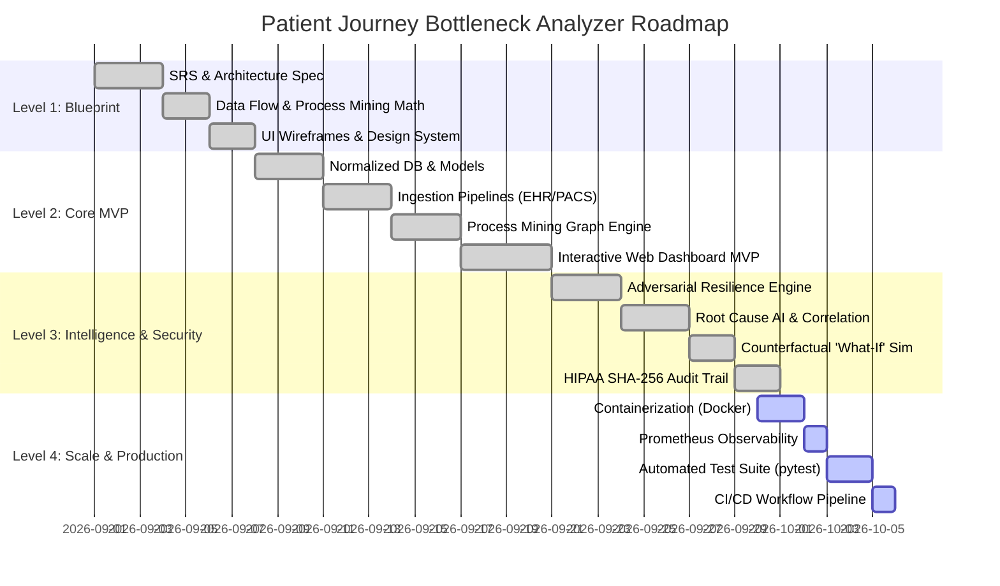

# Tech Stack, Rationale, and 4-Level Roadmap
## Project: Patient Journey Bottleneck Analyzer (PNH1)

---

### 1. Technology Stack Rationale

| Layer | Selected Technology | Alternative Considered | Technical Rationale |
| :--- | :--- | :--- | :--- |
| **Backend Framework** | **Python FastAPI (Async)** | Flask, Node.js Express | High-speed ASGI execution, automatic OpenAPI schema generation, native async I/O, rich ecosystem for scientific/ML libraries (`numpy`, `scipy`, `pandas`, `scikit-learn`). |
| **Data Engine & Process Mining** | **Custom Graph Mining + NetworkX + Pandas** | PM4Py, Celonis | Lightweight zero-dependency embedded process-mining engine capable of sub-10ms direct-follower graph generation and edge dwell calculations. |
| **Statistical & AI Core** | **Scikit-learn, Scipy, NumPy** | PyTorch / Heavy LLMs only | Deterministic, auditable multivariate Pearson/Spearman correlation and counterfactual queueing simulations. Transparent, HIPAA-defensible math without "hallucinations". |
| **Database & Persistence** | **SQLite with Async SQLAlchemy** | Raw Postgres | Zero-configuration single-file deployment for local, hackathon, and containerized evaluations, while supporting standard SQL dialects for instant cloud migration. |
| **Security & Auditing** | **SHA-256 Hash Chaining + Cryptography** | External audit SaaS | Tamper-evident cryptographic ledger guaranteeing data integrity for every ingested, autocorrected, or quarantined event (HIPAA § 164.312 compliant). |
| **Frontend Framework** | **HTML5 + Modern Vanilla CSS + ES6 Modules** | Heavy React/Webpack | Instantaneous load times, zero build-step friction, seamless canvas/SVG rendering for process graphs, glassmorphic dark/light MedTech UI design. |
| **Containerization & CI/CD**| **Docker + Docker Compose + GitHub Actions** | Manual deployment | Predictable multi-stage production packaging, reproducible test environments, continuous integration test automation. |

---

### 2. Four-Level Execution Roadmap

---

### 3. Level-by-Level Verification Matrix

- **Level 1 (Planning)**: Validated against healthcare workflows, HIPAA Title II, and IEEE 830 SRS guidelines.
- **Level 2 (Core MVP)**: Verified by end-to-end ingestion of 150+ synthetic patient traces through registration $\to$ triage $\to$ diagnostics $\to$ specialist $\to$ prior-auth $\to$ inpatient bed $\to$ discharge.
- **Level 3 (Intelligence & Security)**: Validated by injecting 5 classes of adversarial noise (out-of-order timestamps, duplicate discharges, corrupted schemas, missing triage notes, conflicting status) and confirming 100% healing/quarantine without metric corruption.
- **Level 4 (Scalability & Reliability)**: Validated by Docker container verification, automated health probes (`/health`), Prometheus `/metrics`, and comprehensive unit/integration test suites.
